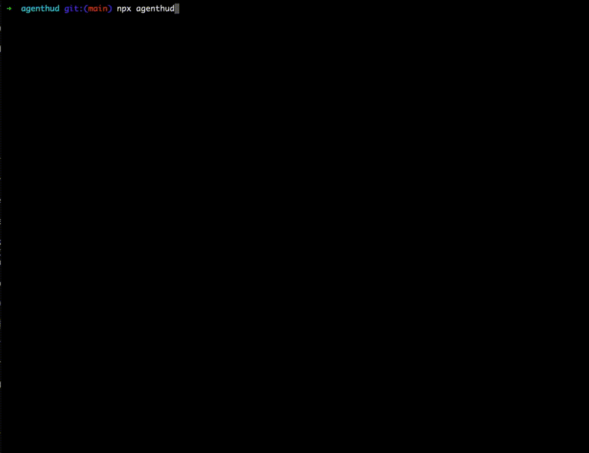

# Agenthud

[](https://www.npmjs.com/package/agenthud)
[](https://github.com/neochoon/agenthud/actions/workflows/ci.yml)
[](https://codecov.io/gh/neochoon/agenthud)

When working with AI coding agents like Claude Code, you lose visibility into what's happening. The agent reads files, runs commands, makes changes - but you're staring at a single terminal, waiting.

**agenthud** gives you a live dashboard in a separate terminal. See exactly what Claude is doing, track git changes, monitor test results - all updating in real-time.



## Install

Requires Node.js 20+

```bash
npx agenthud
```

Run this in a separate terminal while using Claude Code.

## Why?

- **See what the agent is doing** - Watch file reads, edits, bash commands as they happen
- **Track your git state** - Commits, branches, uncommitted changes at a glance
- **Know if tests pass** - Results update automatically, shows if outdated
- **Stay oriented** - Project info, dependencies, file counts

## Usage

```
agenthud [command] [options]

Commands:
  init              Create config file in current directory

Options:
  -w, --watch       Watch mode (default)
  --once            Run once and exit
  -V, --version     Show version
  -h, --help        Show help
```

## Configuration

Optional. Create `.agenthud.yaml` to customize:

```yaml
panels:
  claude:
    enabled: true
    interval: 5s
    max_activities: 20
  git:
    enabled: true
    interval: 30s
  tests:
    enabled: true
    interval: manual  # press 't' to run
  project:
    enabled: true
    interval: 60s
```

## Keyboard

- `q` quit
- `r` refresh all
- `t` run tests (when manual)

## Feedback

Issues and PRs welcome at [GitHub](https://github.com/neochoon/agenthud).

## License

MIT
