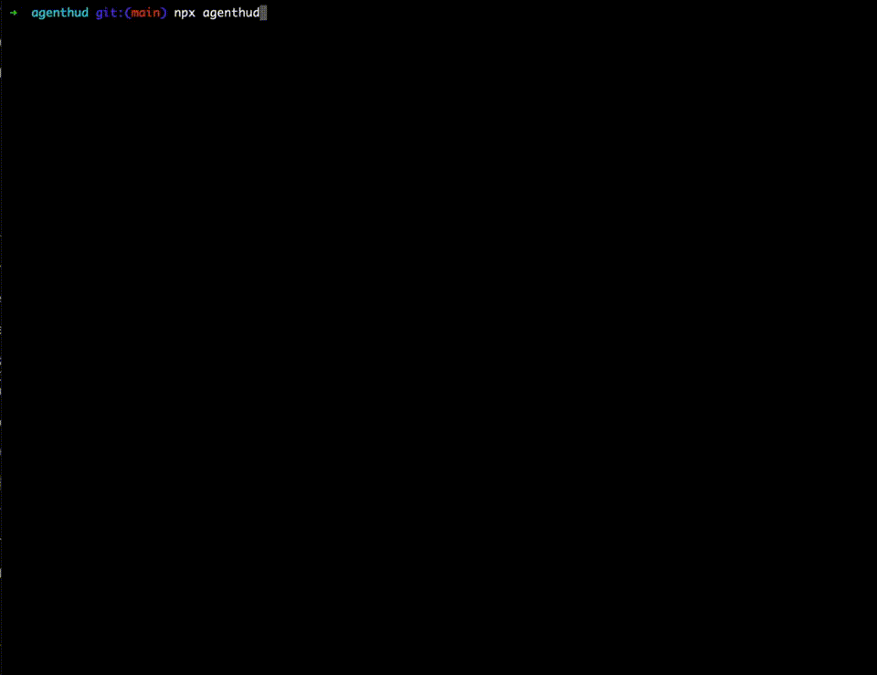

# AgentHUD

[](https://www.npmjs.com/package/agenthud)
[](https://github.com/neochoon/agenthud/actions/workflows/ci.yml)
[](https://codecov.io/gh/neochoon/agenthud)

When working with AI coding agents like Claude Code, you lose visibility into what's happening across sessions. **AgentHUD** gives you a live session browser in a separate terminal — see every session, sub-agent, and activity as it happens.



## Install

Requires Node.js 20+.

```bash
npx agenthud
```

Run this in a separate terminal while using Claude Code.

## What it shows

AgentHUD reads Claude Code's session files from `~/.claude/projects/` and displays them in a split view:

```
┌─ Sessions ──────────────────────────────────────────────┐
│ > agenthud                                              │
│     sub-agent: code-reviewer                            │
│   myproject                                             │
│   dotfiles                                              │
└─────────────────────────────────────────────────────────┘
┌─ Activity · agenthud ───────────────────────────────────┐
│ [10:23:45] ○ Read  src/ui/App.tsx                       │
│ [10:23:46] ~ Edit  src/ui/App.tsx                       │
│ [10:23:47] $ Bash  npm test                             │
│ [10:23:50] < Response  Tests passed successfully        │
│ [10:23:51] … Thinking  Analyzing the test results...    │
└─────────────────────────────────────────────────────────┘
```

**Session tree (top pane)**
- All Claude Code sessions across all projects
- Sub-agents shown nested under their parent session
- Live indicator on currently active session

**Activity viewer (bottom pane)**
- Real-time activity feed for the selected session
- File reads, edits, bash commands, responses, thinking blocks
- Automatically tails the live session; press `g` to scroll back to top

## Activity types

| Icon | Type | Description |
|------|------|-------------|
| `○` | Read | File being read |
| `~` | Edit / Write | File being modified |
| `$` | Bash | Shell command |
| `*` | Glob / Grep | File search |
| `@` | WebFetch / WebSearch | Web request |
| `»` | Task | Sub-agent task |
| `<` | Response | Claude's text response |
| `>` | User | Your message |
| `…` | Thinking | Claude's thinking (requires `showThinkingSummaries: true`) |

## Keyboard shortcuts

### Session tree focus

| Key | Action |
|-----|--------|
| `↑` / `k` | Select previous session |
| `↓` / `j` | Select next session |
| `↵` | Expand / collapse sub-agents |
| `h` | Hide session or sub-agent |
| `Tab` | Switch to activity viewer |
| `PgUp` / `Ctrl+B` | Page up |
| `PgDn` / `Ctrl+F` | Page down |
| `r` | Refresh |
| `q` | Quit |

### Activity viewer focus

| Key | Action |
|-----|--------|
| `↑` / `k` | Scroll up |
| `↓` / `j` | Scroll down |
| `g` | Jump to top |
| `G` | Jump to bottom (live) |
| `↵` | Open detail view |
| `s` | Save log to `~/.agenthud/logs/` |
| `Tab` | Switch to session tree |
| `PgUp` / `Ctrl+B` | Page up |
| `PgDn` / `Ctrl+F` | Page down |
| `Ctrl+U` | Half page up |
| `Ctrl+D` | Half page down |
| `q` | Quit |

### Detail view (full content)

Press `↵` on any activity to open a scrollable full-content view.

| Key | Action |
|-----|--------|
| `↑` / `k` | Scroll up |
| `↓` / `j` | Scroll down |
| `↵` / `Esc` / `q` | Close |

## Report

Print a Markdown summary of all activity on a given date, suitable for piping to scripts or LLMs:

```bash
agenthud report                          # today
agenthud report --date 2026-05-14        # specific date
agenthud report --date today --include all  # all activity types
```

Output is written to stdout in Markdown format:

```
# AgentHUD Report: 2026-05-14

## myproject (10:23 – 14:45)

[10:23] $ npm test
[10:35] ~ src/ui/App.tsx
[11:15] < Added spinner hook to make the UI feel alive.
```

**`--include` types:** `response`, `bash`, `edit`, `thinking`, `read`, `glob`, `user`  
Default: `response,bash,edit,thinking`

## Configuration

Optional. Create `~/.agenthud/config.yaml`:

```yaml
refreshInterval: 2s       # How often to poll for updates (default: 2s)
logDir: ~/.agenthud/logs  # Where to save logs with 's' key

# Sessions/sub-agents to hide from the tree
hiddenSessions:
  - old-project
hiddenSubAgents:
  - code-reviewer
```

## Environment Variables

| Variable | Default | Description |
|----------|---------|-------------|
| `CLAUDE_PROJECTS_DIR` | `~/.claude/projects` | Path to Claude Code projects directory. Useful for backups or mounted volumes. |

## Feedback

Issues and PRs welcome at [GitHub](https://github.com/neochoon/agenthud).

## License

MIT
